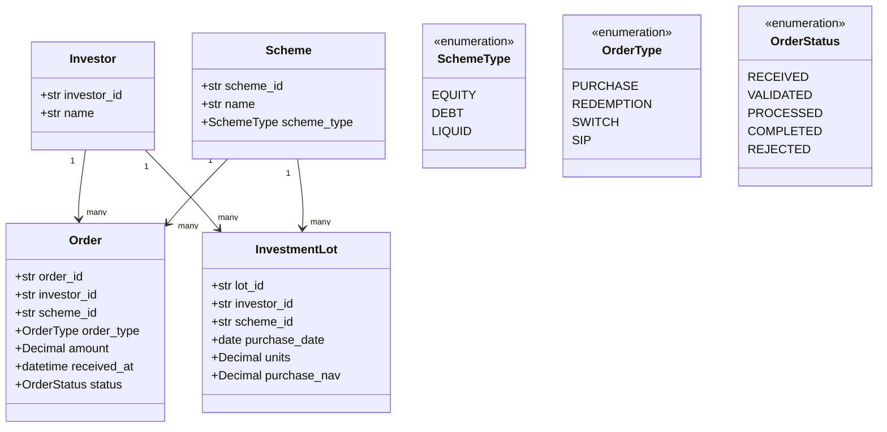

# UML Class Diagram

```mermaid
classDiagram
    class Scheme {
        +str scheme_id
        +str name
        +SchemeType scheme_type
    }
    class Investor {
        +str investor_id
        +str name
    }
    class Order {
        +str order_id
        +str investor_id
        +str scheme_id
        +OrderType order_type
        +Decimal amount
        +datetime received_at
        +OrderStatus status
    }
    class InvestmentLot {
        +str lot_id
        +str investor_id
        +str scheme_id
        +date purchase_date
        +Decimal units
        +Decimal purchase_nav
    }
    class SchemeType {
        <<enumeration>>
        EQUITY
        DEBT
        LIQUID
    }
    class OrderType {
        <<enumeration>>
        PURCHASE
        REDEMPTION
        SWITCH
        SIP
    }
    class OrderStatus {
        <<enumeration>>
        RECEIVED
        VALIDATED
        PROCESSED
        COMPLETED
        REJECTED
    }
    Investor "1" --> "many" Order
    Scheme "1" --> "many" Order
    Investor "1" --> "many" InvestmentLot
    Scheme "1" --> "many" InvestmentLot
```
