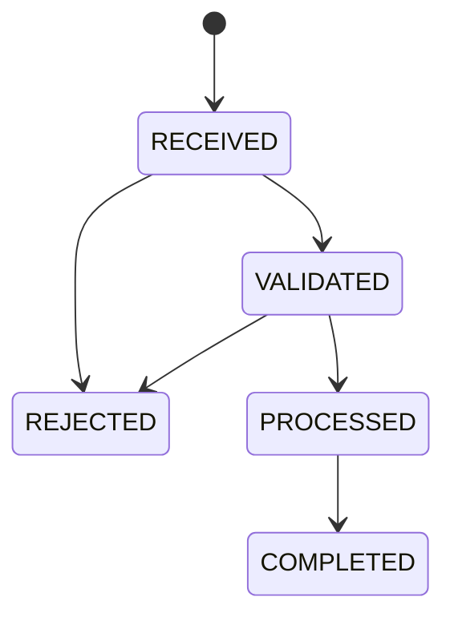

# Order State Diagram

```mermaid
stateDiagram-v2
    [*] --> RECEIVED
    RECEIVED --> VALIDATED
    RECEIVED --> REJECTED
    VALIDATED --> PROCESSED
    VALIDATED --> REJECTED
    PROCESSED --> COMPLETED
```

The diagram shows the supplied status names. Exact transition rules and whether a processed order can fail remain for mentor clarification.
